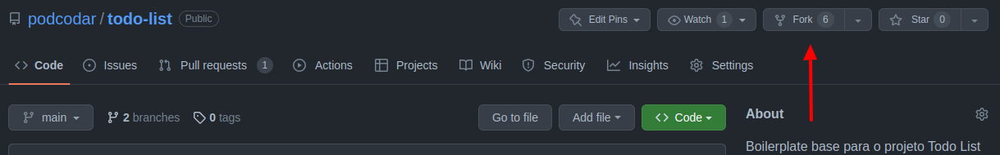
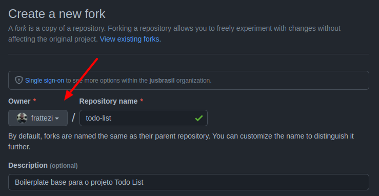

# Seja bem vindo ao Todo-list

O Todo-list foi um projeto escolhido pela comunidade para iniciar os estudos com typeScript e revisar conceitos de react.

## Setup inicial

Primeiramente, faça um `fork` do projeto para sua conta pessoal no github. Na página do github clique em `Fork` :



Você será redirecionado para a página de novo `Fork`, selecione seu usuário como owner e clique em
`Create Fork`:



Com o `fork` pronto, clone o repositório para sua máquina. Acesse a pasta clonada via terminal e instale as dependências utilizando o `yarn` [Doc](https://chore-update--yarnpkg.netlify.app/pt-BR/docs/cli/install)

```sh
# Acessar a pasta clonada
cd /path-to-repository

# Instala as dependências do projeto
yarn

# Iniciar o projeto
yarn dev
```

Ao iniciar o projeto com o comando `yarn dev` você pode acessar sua aplicação no browser no endereço
`http://localhost:3000`.

## Tasks

Para finalizar este projeto, você deve completar as seguintes tasks:

- [ ] Crie um readme para o seu projeto.
- [ ] Publique o projeto no git hub pages. [Doc](https://github.com/gitname/react-gh-pages)
- [ ] Implemente a funcionalidade criar task.
- [ ] Implemente a funcionalidade editar task.
- [ ] Implemente a funcionalidade deletar task.
- [ ] Implemente o filtro de tarefas completas.
- [ ] Implemente o filtro de tarefas pendentes.

### Task Extra

- [ ] Refatore e implemente Context na aplicação.

## Fluxo de desenvolvimento

- Um dos objetivos deste projeto e trabalharmos o mais próximo possível do fluxo de trabalho real. Com isso é muito importante que cada tarefa seja desenvolvida em uma branch, e so depois de aprovada no codeReview seja mergeada na main. [Doc](https://www.notion.so/Git-Guidelines-1281dded381c40e082b79d3d28c2cc8a)

- Cada pull request deve limitar-se ao escopo de uma tarefa específica.

### Padrões de commit e base de código

Neste projeto estamos utilizando algumas ferramentas que nos ajudam a manter padrões de commit e código. Para os commits utilizamos o husky que valida o nome de commit, para os padrões configurados no projeto todo commit tem que ter algum dos seguintes prefixos;

- feat: para commits que criam uma nova funcionalidade ex: feat: implement function createNew task.
- chore: para commits de melhorias como instalação ou update de pacotes ex chore: update react version
- fix: para commits de correção ex: fix: resolved bug of tasks insertions.

Já para manter os padrões de código temos o eslint configurado, que irá garantir que a base de código mesmos padrões relacionadas a semântica do código.

[Documentação de apoio](https://www.notion.so/podcodar/React-3f5f9a2cc3aa48dd94fd6f2bb41b8100)

**:rocket: Faça seu Fork e bora Codar! :rocket:**
